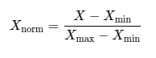

# Nesta apresentação, vamos abordar a importação de dados de Performance de Dota 2 para o Docker e o Cassandra.

## Passos para Importação de Dados

### Usando a biblioteca pandas
```python
import pandas as pd

# Carregar os CSVs para DataFrames
hero_stats_df = '../Current_Pro_meta.csv'
heroes_df = '../All_Heroes_ID.csv'

# Carregar o CSV 'Current_Pro_meta.csv' para um DataFrame
df = pd.read_csv(hero_stats_df)

# Remover colunas desnecessárias para a normalização e para adicionar performance_id e hero_id
cols_remover = ['Primary Attribute', 'Attack Type', 'Attack Range', 'Name', 'Roles']
df = df.drop(cols_remover, axis=1)

# Normalização estatística das colunas
# A normalização Min-Max ajusta os valores de uma coluna para que fiquem em uma escala entre 0 e 1.
col_normalizar = ['Total Pro wins', 'Times Picked', 'Times Banned', 'Win Rate']
for col in col_normalizar:
    if col in df.columns:
        df[col + ' normalized'] = (df[col] - df[col].min()) / (df[col].max() - df[col].min())


```



```python
# Adicionar uma coluna 'performance_id' com valores sequenciais começando em 1
df['performance_id'] = range(1, len(df) + 1)

# Carregar o CSV 'All_Heroes_ID.csv' para obter o hero_id
heroes_df = pd.read_csv(heroes_df)

# Verificar as colunas disponíveis no DataFrame heroes_df
print(heroes_df.columns)

# Assumindo que há uma coluna comum, por exemplo, 'Hero ID' para a junção
# Mesclar os DataFrames para adicionar o hero_id
df = df.merge(heroes_df[['Hero ID', 'hero_id']], on='Hero ID', how='left')

# Salvar o DataFrame final em um arquivo CSV
pro_meta = './performance.csv'
df.to_csv(pro_meta, index=False)

print("Arquivo 'performance.csv' salvo com sucesso!")

```


## Entrar no container do Docker e usar o keyspace

```
$ docker exec -it conexaodb cqlsh

$ USE dota;

```

## Criar a tabela no Cassandra
``` 
CREATE TABLE dota.performance (
    performance_id int PRIMARY KEY,
    hero_id int,
    niche_hero boolean,
    times_banned int,
    times_banned_normalized float,
    times_picked int,
    times_picked_normalized float,
    total_pro_wins int,
    total_pro_wins_normalized float,
    win_rate float,
    win_rate_normalized float,
    FOREIGN KEY (hero_id) REFERENCES dota.heroes(hero_id)
);

 ```
## Dicionário de dados

- **performance_id** (INT):
  - Identificador único do desempenho (chave primária).
  - Tipo: Inteiro

- **hero_id** (INT):
  - Identificador único do herói.
  - Tipo: Inteiro
  - Descrição: Chave estrangeira que referencia o `hero_id` na tabela `dota.heroes`.

- **niche_hero** (BOOLEAN):
  - Indica se o herói é considerado de nicho.
  - Tipo: Booleano
  - Descrição: `True` se o herói é considerado de nicho, `False` caso contrário.

- **times_banned** (INT):
  - Número de vezes que o herói foi banido.
  - Tipo: Inteiro
  - Descrição: O número total de vezes que o herói foi banido em jogos profissionais.

- **times_banned_normalized** (FLOAT):
  - Número de vezes que o herói foi banido, normalizado.
  - Tipo: Ponto Flutuante
  - Descrição: O número de vezes que o herói foi banido, ajustado por algum fator de normalização.

- **times_picked** (INT):
  - Número de vezes que o herói foi escolhido.
  - Tipo: Inteiro
  - Descrição: O número total de vezes que o herói foi escolhido em jogos profissionais.

- **times_picked_normalized** (FLOAT):
  - Número de vezes que o herói foi escolhido, normalizado.
  - Tipo: Ponto Flutuante
  - Descrição: O número de vezes que o herói foi escolhido, ajustado por algum fator de normalização.

- **total_pro_wins** (INT):
  - Número total de vitórias do herói em jogos profissionais.
  - Tipo: Inteiro
  - Descrição: O número total de vitórias do herói em jogos profissionais.

- **total_pro_wins_normalized** (FLOAT):
  - Número total de vitórias do herói em jogos profissionais, normalizado.
  - Tipo: Ponto Flutuante
  - Descrição: O número total de vitórias do herói, ajustado por algum fator de normalização.

- **win_rate** (FLOAT):
  - Taxa de vitória do herói.
  - Tipo: Ponto Flutuante
  - Descrição: A porcentagem de vitórias do herói em relação ao número total de jogos em que foi escolhido.

- **win_rate_normalized** (FLOAT):
  - Taxa de vitória do herói, normalizada.
  - Tipo: Ponto Flutuante
  - Descrição: A taxa de vitória do herói, ajustada por algum fator de normalização.


## Importar os dados do CSV para a tabela

```
$ COPY dota.heroes (hero_id, name, primary_attribute, attack_type, attack_range) FROM 'herois.csv' WITH DELIMITER=',' AND HEADER=TRUE;

```
